## Objetivos personales 

* Aprender más sobre Scrum y como emplearla en la vida real.
* Aprender a trabajar en grupo mediante plataformas digitales.
* Aprender a usar mejor herramientas de prototipado, para así mejorar nuestras interfaces de usuario.

## Investigación :dog:

La investigación se realizó a personas que aman a los animales, muchas de ellas dicen que si bien hay sitios en internet en favor de ellos, no hay una plataforma en la cual puedan interactuar entre si, ya sea publicando fotos, recomendaciones, articulos en venta, etc.

Por la cuál se va a crear una **Red Social** para nuestros amigos caninos de cuatro patas. 

La Red Social constara con los siguientes modulos:

* Tienda Pet
* Adopción 
* Veterinaria 

**Tienda Pet** servirá para que las personas puedan poner a la venta sus productos que esten relacionados con nuestras mascotas.

### Wireframes (Balsamiq)

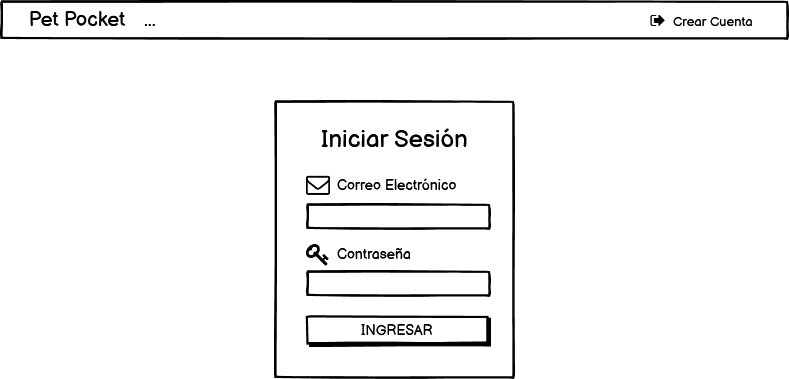

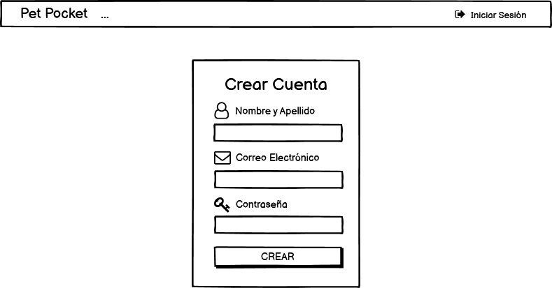

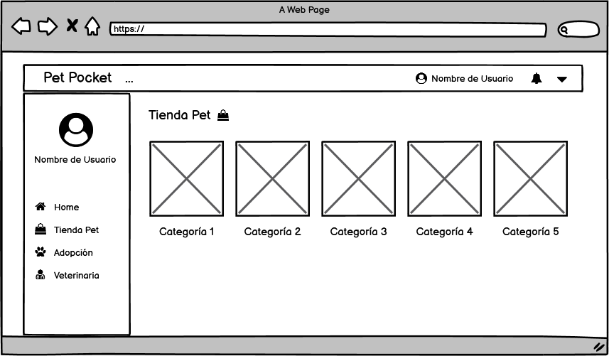

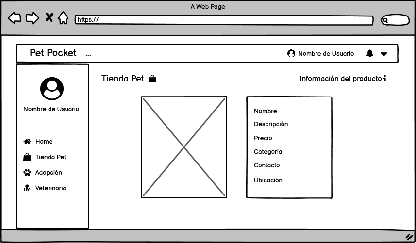

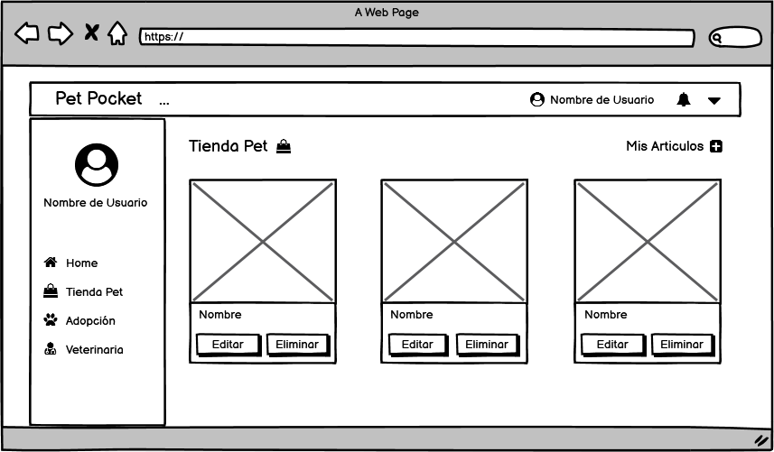

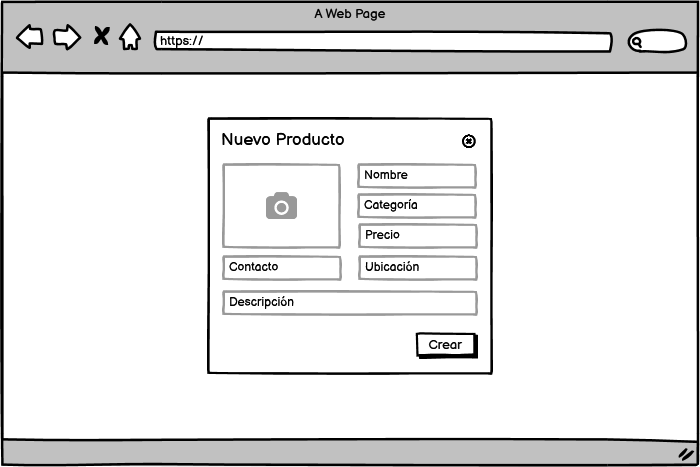

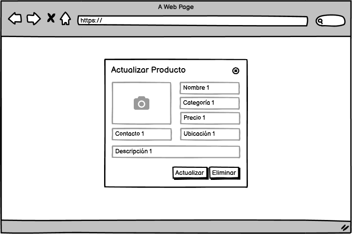

### Mockups (Adobe xd)

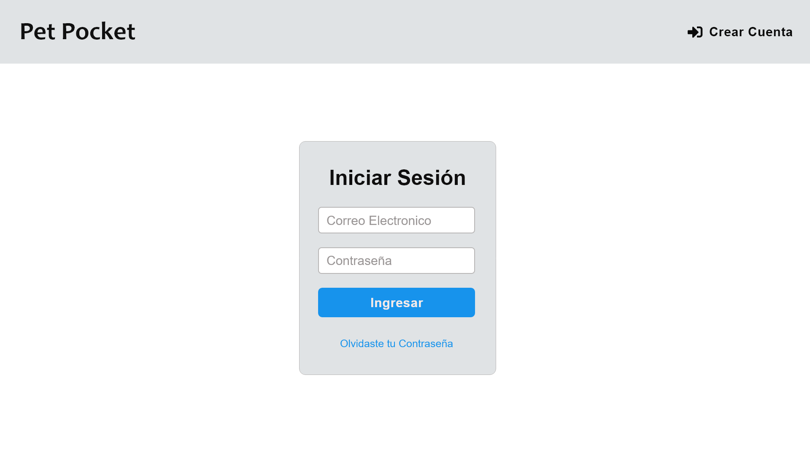

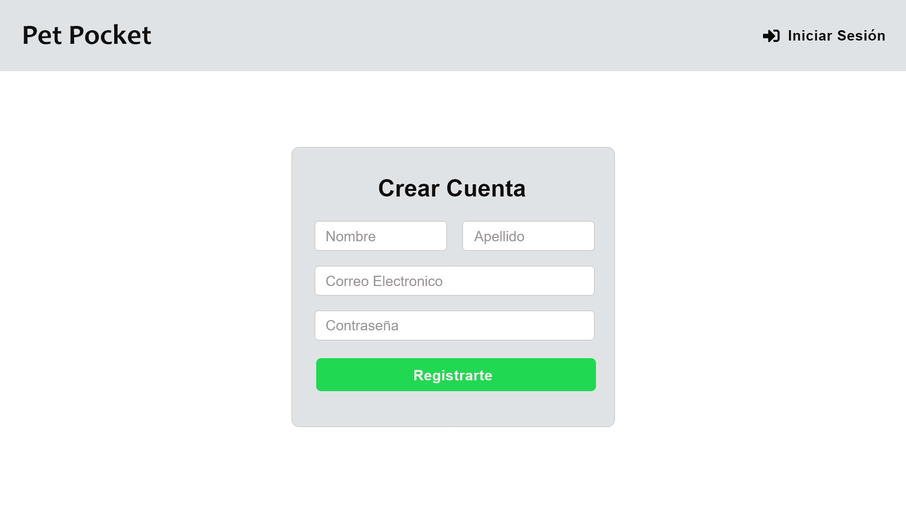

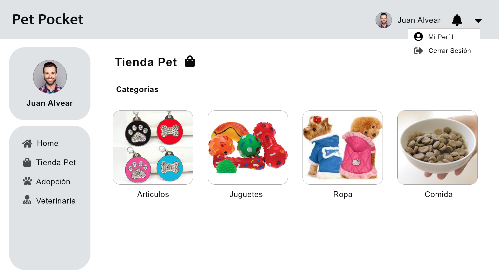

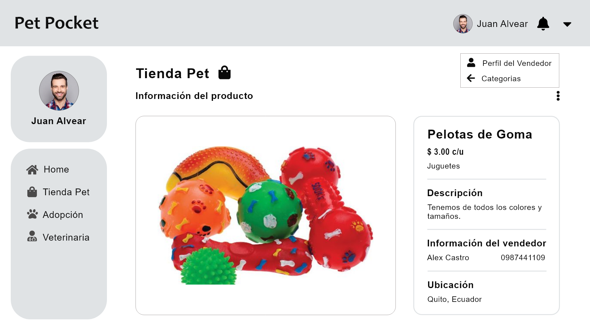

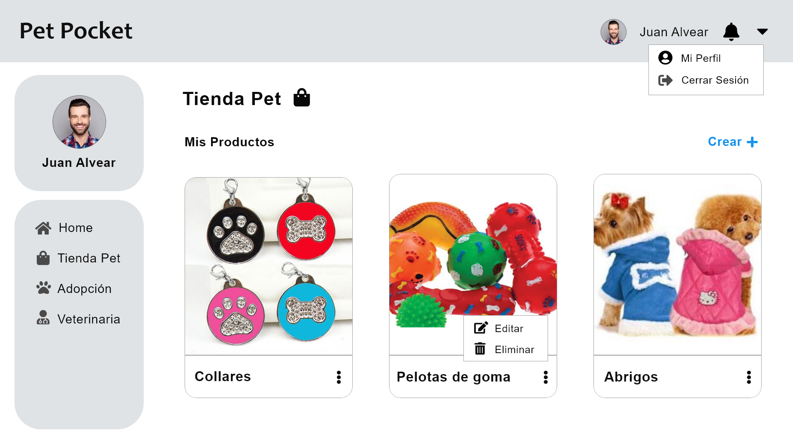

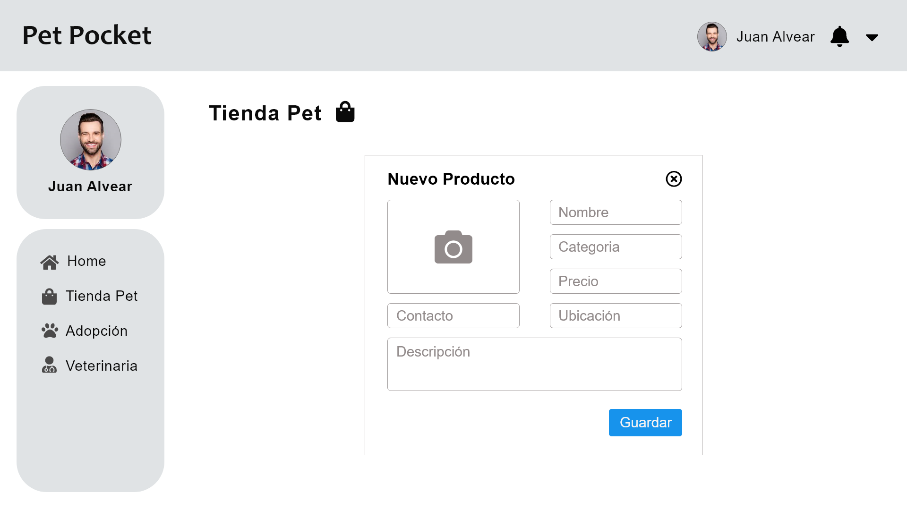

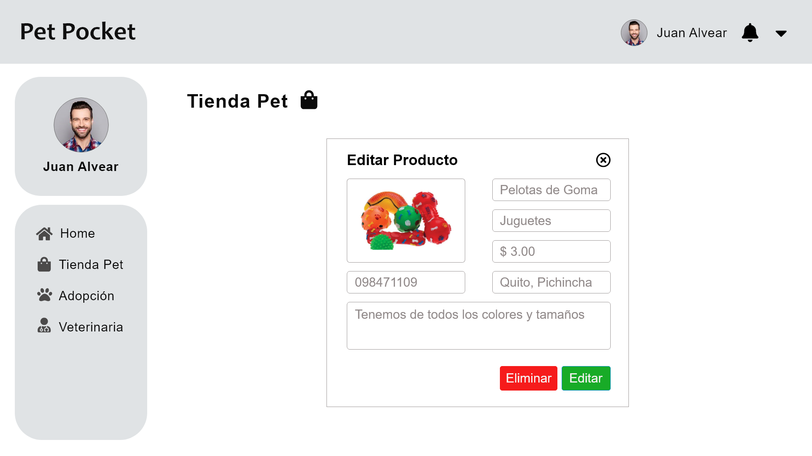

