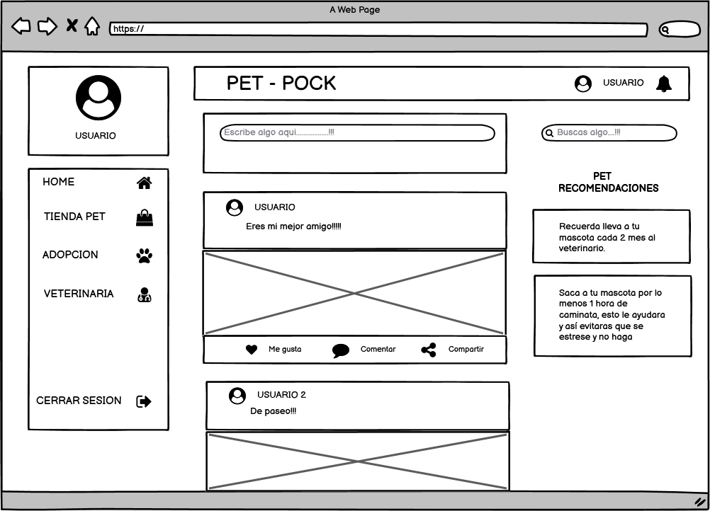
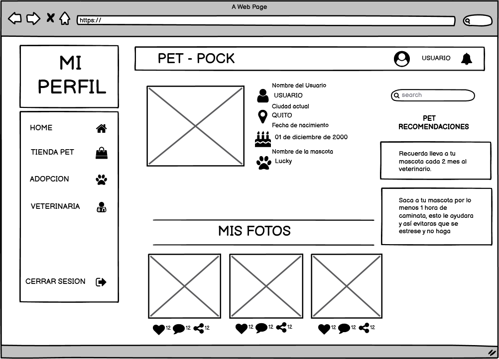
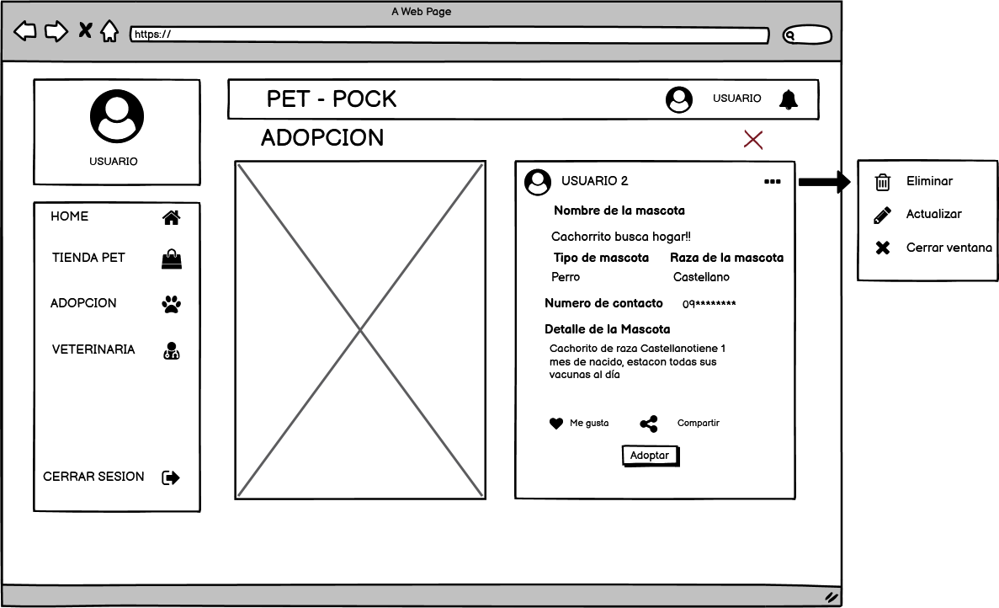
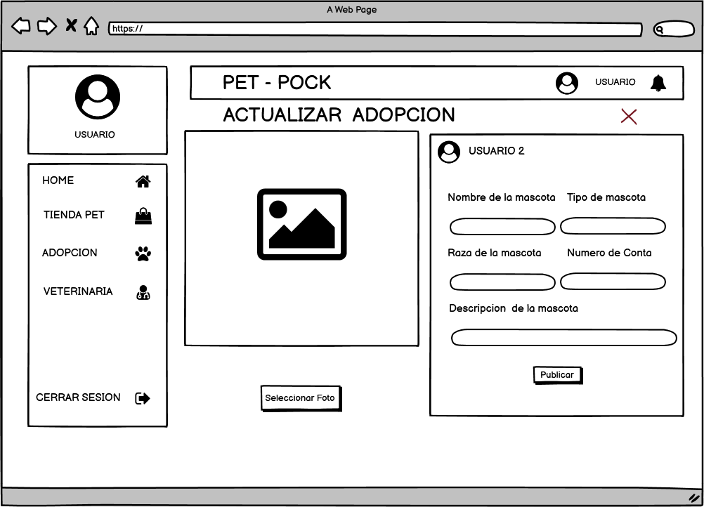
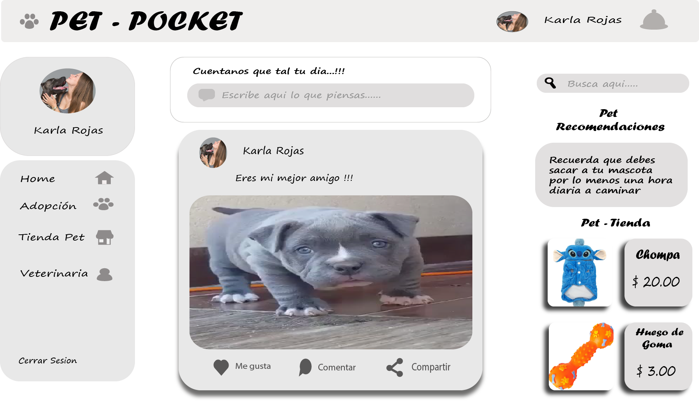
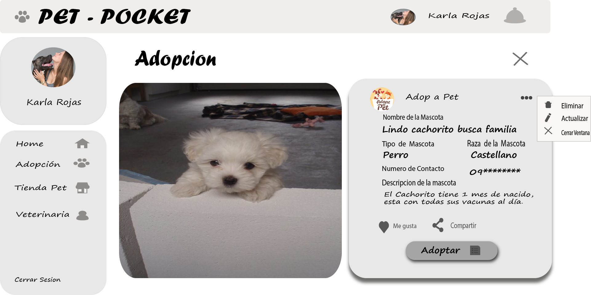

## Investigación :dog:

La investigación se realizó a personas que aman a los animales, muchas de ellas dicen que si bien hay sitios en internet en favor de ellos, no hay una plataforma en la cual puedan interactuar entre si, ya sea publicando fotos, recomendaciones, articulos en venta, etc.

Por la cuál se va a crear una **Red Social** para nuestros amigos caninos de cuatro patas. 

La Red Social constara con los siguientes modulos:

* Home
* Tienda Pet
* Adopción 
* Veterinaria 

<<<<<<< HEAD
**Adopción** servirá para que las personas puedan sobre mascotas que buscan un hogar.

=======
**Adopción** servirá para que las personas puedan publicar sobre mascotas que busquen un hogar y a la vez poder adoptar a las mismas.
>>>>>>> eefd56e1cb05c7ce36f79abfa20b445485c77352

### Wireframes (Balsamiq)

 

<<<<<<< HEAD

### Mockups (Adobe xd)

=======

### Mockups (Adobe xd)

>>>>>>> eefd56e1cb05c7ce36f79abfa20b445485c77352

